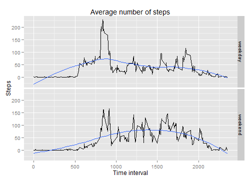

# Reproducible Research: Peer Assessment 1


## Loading and preprocessing the data
Read dataset directly from archive, cast 'date' column as *Date* class and look to this data.

```r
zipfile <- unz('activity.zip', 'activity.csv')
activity <- read.csv(zipfile)
activity$date <- as.Date(activity$date, format="%Y-%m-%d")
str(activity)
```

```
## 'data.frame':	17568 obs. of  3 variables:
##  $ steps   : int  NA NA NA NA NA NA NA NA NA NA ...
##  $ date    : Date, format: "2012-10-01" "2012-10-01" ...
##  $ interval: int  0 5 10 15 20 25 30 35 40 45 ...
```

```r
head(activity)
```

```
##   steps       date interval
## 1    NA 2012-10-01        0
## 2    NA 2012-10-01        5
## 3    NA 2012-10-01       10
## 4    NA 2012-10-01       15
## 5    NA 2012-10-01       20
## 6    NA 2012-10-01       25
```

## What is mean total number of steps taken per day?
**Important**: *In this step we're ingoring missing values.*

First we group data on date and look at distribution of total number of steps taken each day:

```r
library(plyr)
sum.day.steps <- ddply(activity, .(date), summarize, sum.steps=sum(steps))

library(ggplot2)
ggplot(sum.day.steps, aes(x=sum.steps)) + geom_histogram(binwidth=2500) +
    labs(x="Steps per day", y = "Count", title = "Total number of steps taken each day")
```

 

And calculate mean and median number of steps taken per day:

```r
mean(sum.day.steps$sum.steps, na.rm = TRUE)
```

```
## [1] 10766
```

```r
median(sum.day.steps$sum.steps, na.rm = TRUE)
```

```
## [1] 10765
```

## What is the average daily activity pattern?
To extract daily activity pattern, we can average number of steps in specific time interval across all days:

```r
avg.day.steps <- ddply(activity, .(interval), summarize, avg.steps = mean(steps, na.rm=TRUE))
ggplot(avg.day.steps, aes(x=interval, y=avg.steps)) + geom_line(size=0.5) +
    labs(x="Time interval", y="Steps", title="Average number of steps (across all days)")
```

 

5-minute interval which contains (on average) the maximum number of steps is:

```r
avg.day.steps[which.max(avg.day.steps$avg.steps), 1]
```

```
## [1] 835
```


Which related to 5-minute time interval started at **13:55**.

## Imputing missing values
Missing values apears in 'steps' column. Total number of missing values:

```r
sum(is.na(activity$steps))
```

```
## [1] 2304
```

For imputing these missing values, all NA's are replacing with mean number of steps in that time interval (rounded to the nearest integer). Mean numbers of steps across all days were calculated in previous section.

For this purpose we merge *acitivity* and *avg.day.steps*  datasets on 'interval' column and then substitute NA's with averaged and rounded numbers of steps in specific interval (now these values in the same row). At last we remove intermediary column, sort data by date and re-arrange columns to original order.

```r
activity.tidy <- merge(activity, avg.day.steps, by="interval", all.x=TRUE)
activity.tidy[is.na(activity.tidy$steps), 2] <- 
    round(activity.tidy[is.na(activity.tidy$steps), 4])

activity.tidy <- activity.tidy[with(activity.tidy, order(date, interval)), ]
activity.tidy <- subset(activity.tidy, select=c(steps, date, interval))
```

Ensure that new dataset contains no missing values:

```r
summary(activity.tidy)
```

```
##      steps            date               interval   
##  Min.   :  0.0   Min.   :2012-10-01   Min.   :   0  
##  1st Qu.:  0.0   1st Qu.:2012-10-16   1st Qu.: 589  
##  Median :  0.0   Median :2012-10-31   Median :1178  
##  Mean   : 37.4   Mean   :2012-10-31   Mean   :1178  
##  3rd Qu.: 27.0   3rd Qu.:2012-11-15   3rd Qu.:1766  
##  Max.   :806.0   Max.   :2012-11-30   Max.   :2355
```

After imputing missing values we again look at distribution of total number of steps taken each day.

```r
tidy.sum.day.steps <- ddply(activity.tidy, .(date), summarize, sum.steps=sum(steps))

ggplot(tidy.sum.day.steps, aes(x=sum.steps)) + geom_histogram(binwidth=2500) +
    labs(x="Steps per day", y = "Count", title = "Total number of steps taken each day")
```

 

Now mean and median values of total steps per day are:

```r
mean(tidy.sum.day.steps$sum.steps)
```

```
## [1] 10766
```

```r
median(tidy.sum.day.steps$sum.steps)
```

```
## [1] 10762
```

These values almost the same in case we ignore missing values at all. So for this particular dataset and this type of analysis it's not ver important to handle missing values.

## Are there differences in activity patterns between weekdays and weekends?

First we add column indicating type of a day - weekday or weekend. Under 'weekend' we mean Saturday and Sunday. 

```r
map.weekdays <- function(date) {
    dayname <- weekdays(date)
    if (tolower(dayname) %in% c("saturday", "sunday"))
        return ("weekend")
    else
        return ("weekday")
}

activity.tidy$day.type <- as.factor(sapply(activity.tidy$date, map.weekdays))
```

And make a panel plot which allows to compare daily activity patterns across different types of days.

```r
tidy.avg.day.steps <- ddply(activity.tidy, .(interval, day.type), summarize, avg.steps = mean(steps))

ggplot(tidy.avg.day.steps, aes(x=interval, y=avg.steps)) + geom_line(size=0.5) +
    facet_grid(day.type ~ . ) +
    labs(x="Time interval", y="Steps", title="Average number of steps")
```

 

So we can see that during weekend human activity is less 'stable' and starts later.
